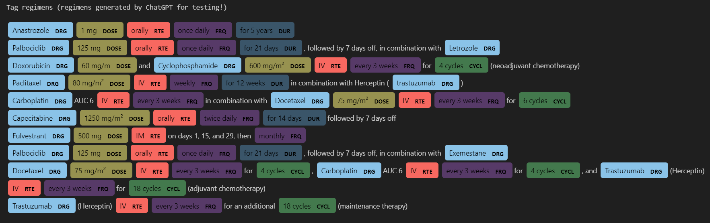

### Example of a NER model using Spacy Rule-Based Matching
- python verison 3.10
- use OMOP concepts to generate patterns and tags  
- save model to disk  
- use the model on some oncology regimens generated from ChatGPT  

